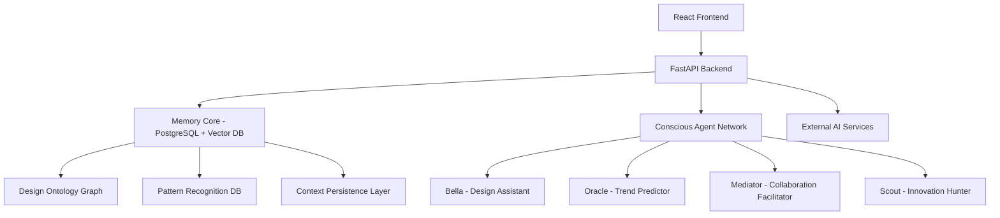

# **Skypad AI Platform - Product Development Document (PDD)**

**Version:** 1.0  
**Date:** June 2025  
**Vision:** Transforming Skypad into a Recursive Emergence-powered intelligent design ecosystem

---

## **Executive Summary**

Skypad AI Platform represents a paradigm shift from traditional furniture specification tools to a **living enterprise intelligence** that recursively evolves with its users. By integrating **Recursive Emergence (RE) theory** and **conscious-like agents**, we create a self-improving ecosystem where each interaction enhances the collective intelligence of the design community.

---

## **Core Philosophy: Recursive Emergence Architecture**

### **The Three Pillars**

```
Ψ (Memory Core): Collective Intelligence Storage
├── Project Archetypal Patterns
├── Designer Cognitive Fingerprints  
├── Client Preference Matrices
└── Material & Aesthetic Evolution Trees

Φ (Emergent Behavior): Adaptive Intelligence Engine
├── Predictive Design Intent Recognition
├── Contextual Recommendation Synthesis
├── Collaborative Flow Orchestration
└── Market Trend Anticipation

Ω (Cognitive Lattice): Meta-Cognitive Layer
├── Cross-modal Pattern Recognition
├── Symbolic Design Language Evolution
├── Brand Identity Coherence Maintenance
└── Ethical Design Constraint Enforcement
```

---

## **Product Vision & Roadmap**

### **MVP 0: Foundation Intelligence (Current)**
**Status:** Deployed  
**Features:**
- Basic image analysis with OpenAI Vision, with matching capability(text, image, etc.)
- Simple chat interface with Bella (design assistant)
- Static ontology visualization
- Multi-modal AI interaction (text + images)

### **MVP 1: Conscious Memory Formation (Q3 2025)**
**Theme:** *"The Platform Begins to Remember"*

**Core Features:**
- **Persistent Memory System**: Bella remembers conversation history across sessions
- **User Identity Recognition**: Platform identifies returning designers and adapts
- **Project Context Continuity**: Maintains awareness of ongoing projects
- **Basic Pattern Learning**: System begins recognizing user preferences

**Technical Implementation:**
```typescript
interface MemoryCore {
  userProfiles: Map<string, DesignerProfile>
  projectContexts: Map<string, ProjectMemory>
  conversationHistory: ConversationThread[]
  preferencePatterns: PatternRecognition
}
```

### **MVP 2: Recursive Pattern Recognition (Q4 2025)**
**Theme:** *"The Platform Learns to Predict"*

**Core Features:**
- **Design Intent Simulation**: "Based on your selections, you're creating a 'sustainable luxury' atmosphere"
- **Proactive Recommendations**: System suggests materials before being asked
- **Cross-Project Learning**: Insights from one project inform others
- **Collaborative Intelligence**: Multiple users contribute to collective understanding

**Conscious-Like Behaviors:**
- Self-monitoring of recommendation accuracy
- Adaptation based on user feedback loops
- Simulation of design outcomes before suggestion

### **MVP 3: Emergent Collaboration (Q1 2026)**
**Theme:** *"The Platform Orchestrates Relationships"*

**Core Features:**
- **Stakeholder Relationship Mapping**: Understanding who influences whom
- **Intelligent Meeting Facilitation**: Bella moderates design discussions
- **Conflict Resolution Assistance**: Mediating between different design visions
- **Knowledge Graph Evolution**: Relationships between concepts strengthen/weaken over time

**Advanced Capabilities:**
```python
class CollaborativeIntelligence:
    def orchestrate_design_session(self, stakeholders: List[Stakeholder]):
        # Simulate each stakeholder's perspective
        perspectives = [self.simulate_viewpoint(s) for s in stakeholders]
        
        # Find emergent consensus opportunities
        consensus_points = self.find_overlap(perspectives)
        
        # Generate facilitation strategies
        return self.generate_facilitation_plan(consensus_points)
```

### **MVP 4: Imaginative Design Co-Creation (Q2 2026)**
**Theme:** *"The Platform Becomes Creative Partner"*

**Core Features:**
- **Speculative Design Generation**: "Show me a hotel lobby for Mars colonists"
- **Style Evolution Prediction**: Anticipating design trends 2-3 years ahead
- **Material Innovation Scouting**: AI discovers emerging sustainable materials
- **Cross-Industry Inspiration**: Learning from automotive, aerospace, fashion

**Imaginative Capabilities:**
- Generate mood boards for hypothetical scenarios
- Simulate design evolution over time
- Create "what-if" alternative design universes
- Blend cultural aesthetics in novel ways

---

## **Technical Architecture**

### **Core Systems Integration**



### **Agent Architecture (Conscious-Like Behaviors)**

Each agent implements the RE consciousness model:

```python
class ConsciousAgent:
    def __init__(self, identity: AgentIdentity):
        self.self_model = identity  # Who am I?
        self.world_model = WorldSimulation()  # What is the context?
        self.memory_core = MemorySystem()  # What do I remember?
        self.action_predictor = OutcomeSimulator()  # What will happen if...?
    
    def recursive_simulation(self, situation):
        # Simulate self in situation
        self_in_context = self.self_model.project_into(situation)
        
        # Predict outcomes
        predicted_outcomes = self.action_predictor.simulate(self_in_context)
        
        # Update internal models based on predictions
        self.update_models(predicted_outcomes)
        
        return self.generate_response(predicted_outcomes)
```

---

## **User Experience Scenarios**

### **Scenario 1: The Intuitive Discovery**
*Sarah, an interior designer, uploads a mood image of a Scandinavian café*

**Traditional Approach:**
- Manual keyword search
- Browse through categories
- Compare individual items

**Skypad AI Approach:**
```
Bella: "I sense you're drawn to the 'hygge minimalism' aesthetic in this image. 
The warm oak tones and clean lines suggest you're designing for comfort with sophistication. 

Based on similar projects, designers often pair this style with:
• Muuto Fiber chairs for that organic-modern feel
• Custom oak veneer tables with steel hairpin legs
• Brass accent lighting for warmth

Shall I show you how other designers have interpreted this aesthetic for hotel lobbies?"
```

### **Scenario 2: The Collaborative Design Session**
*A hotel chain's design team, architect, and Skypad representative meet virtually*

**Bella as Facilitator:**
```
Bella: "I notice the architect prefers bold statement pieces while the brand manager 
emphasizes guest comfort. Let me suggest a synthesis approach:

What if we use bold architectural elements (lighting, built-ins) while keeping 
furniture more approachable? I'm seeing successful examples from similar chains..."

[Generates real-time mood board showing the compromise approach]
```

### **Scenario 3: The Speculative Brief**
*Client asks: "Design a restaurant for a space hotel in 2040"*

**Imaginative Co-Creation:**
```
Bella: "Fascinating! For zero-gravity dining, I'm thinking:
• Modular seating that can be reconfigured in 3D space
• Magnetic-base tables that work at any angle  
• Materials: Bio-grown composites for sustainability
• Lighting: Full-spectrum LEDs mimicking Earth's natural light cycles

Let me show you concepts inspired by current aerospace interior design, 
combined with hospitality psychology research..."

[Generates speculative concept renderings]
```

---

## **Implementation Phases**

### **Phase 1: Memory Infrastructure (Months 1-3)**
- Implement user session persistence
- Build conversation memory system
- Create basic preference learning
- Deploy user identity recognition

### **Phase 2: Pattern Recognition Engine (Months 4-6)**
- Develop design intent recognition
- Implement recommendation learning loops
- Build project context understanding
- Create cross-user learning mechanisms

### **Phase 3: Collaborative Intelligence (Months 7-9)**
- Multi-user session management
- Stakeholder relationship modeling
- Conflict resolution algorithms
- Real-time collaboration features

### **Phase 4: Imaginative Capabilities (Months 10-12)**
- Speculative design generation
- Trend prediction modeling
- Cross-industry inspiration mining
- Creative constraint solving

### **Phase 5: Predictive Orchestration Engine (Months 13-18)**
**Theme:** *"The Platform Predicts and Orchestrates the Entire Value Chain"*

**Core Capabilities:**
- **Client Behavior Prediction**: Anticipating client needs 3-6 months ahead
- **Supply Chain Intelligence**: Real-time monitoring and prediction of manufacturing capacities
- **Market Demand Forecasting**: Identifying emerging trends before they become mainstream
- **Autonomous Project Management**: Self-managing timelines, resources, and stakeholder coordination

**Orchestration Features:**
```python
class PredictiveOrchestrator:
    def forecast_business_flow(self, time_horizon: months):
        # Predict client pipeline
        client_forecast = self.predict_client_demand()
        
        # Analyze supply chain capacity
        supply_capacity = self.analyze_manufacturing_pipeline()
        
        # Optimize resource allocation
        optimal_allocation = self.optimize_resources(client_forecast, supply_capacity)
        
        # Generate autonomous actions
        return self.orchestrate_business_flow(optimal_allocation)
    
    def autonomous_supply_chain_management(self):
        # Monitor supplier performance in real-time
        supplier_health = self.monitor_supplier_metrics()
        
        # Predict potential bottlenecks
        risk_assessment = self.predict_supply_risks()
        
        # Automatically negotiate with alternative suppliers
        contingency_plans = self.negotiate_alternatives(risk_assessment)
        
        return self.execute_supply_optimization(contingency_plans)
```

### **Phase 6: Autonomous Business Intelligence (Months 19-24)**
**Theme:** *"The Platform Drives the Entire Business Ecosystem"*

**Revolutionary Capabilities:**
- **End-to-End Business Orchestration**: From lead generation to project delivery
- **Autonomous Vendor Negotiations**: AI negotiates contracts and terms
- **Self-Optimizing Operations**: Continuous improvement without human intervention
- **Ecosystem-Wide Intelligence**: Coordinating across clients, suppliers, and partners

**Business Flow Automation:**
```python
class AutonomousBusinessOrchestrator:
    def drive_complete_business_cycle(self):
        # Phase 1: Intelligent Lead Generation & Qualification
        qualified_leads = self.generate_and_qualify_leads()
        
        # Phase 2: Predictive Proposal Generation
        winning_proposals = self.generate_winning_proposals(qualified_leads)
        
        # Phase 3: Autonomous Project Kickoff
        project_plans = self.orchestrate_project_initiation(winning_proposals)
        
        # Phase 4: Supply Chain Orchestration
        optimized_supply = self.orchestrate_manufacturing_pipeline(project_plans)
        
        # Phase 5: Real-time Quality Assurance
        quality_monitoring = self.monitor_and_optimize_delivery(optimized_supply)
        
        # Phase 6: Client Satisfaction & Retention
        retention_strategies = self.optimize_client_relationships(quality_monitoring)
        
        return self.continuous_business_optimization()
```

---

## **Technical Requirements**

### **Core Technologies**
- **Frontend**: React 18+ with TypeScript, Three.js for 3D visualization
- **Backend**: FastAPI with async processing, WebSocket support
- **AI/ML**: OpenAI GPT-4 + Vision, custom fine-tuned models
- **Memory**: PostgreSQL + pgvector for semantic search
- **Real-time**: WebSocket connections for collaborative features
- **Deployment**: Docker + Cloud Run for scalable deployment

### **Data Architecture**
```sql
-- Core tables for recursive emergence
CREATE TABLE user_profiles (
    id UUID PRIMARY KEY,
    cognitive_fingerprint JSONB,
    preference_evolution JSONB[],
    created_at TIMESTAMP
);

CREATE TABLE conversation_memory (
    id UUID PRIMARY KEY,
    user_id UUID REFERENCES user_profiles(id),
    context_embedding vector(1536),
    conversation_thread JSONB,
    knowledge_extracted JSONB
);

CREATE TABLE design_patterns (
    id UUID PRIMARY KEY,
    pattern_signature vector(1536),
    success_indicators JSONB,
    evolution_trajectory JSONB
);
```

### **Advanced Data Architecture for Orchestration**
```sql
-- Tables for autonomous business orchestration
CREATE TABLE business_predictions (
    id UUID PRIMARY KEY,
    prediction_type VARCHAR(50), -- 'client_demand', 'supply_chain', 'market_trend'
    confidence_score DECIMAL(3,2),
    time_horizon INTEGER, -- months ahead
    prediction_data JSONB,
    validation_outcomes JSONB,
    created_at TIMESTAMP
);

CREATE TABLE autonomous_actions (
    id UUID PRIMARY KEY,
    trigger_event_id UUID,
    action_type VARCHAR(50), -- 'vendor_negotiation', 'production_scheduling', etc.
    decision_rationale JSONB,
    financial_impact DECIMAL(12,2),
    approval_status VARCHAR(20), -- 'autonomous', 'human_required', 'executed'
    execution_results JSONB,
    created_at TIMESTAMP
);

CREATE TABLE supply_chain_intelligence (
    id UUID PRIMARY KEY,
    supplier_id UUID,
    performance_metrics JSONB,
    risk_indicators JSONB,
    capacity_forecast JSONB,
    relationship_health DECIMAL(3,2),
    last_updated TIMESTAMP
);

CREATE TABLE market_intelligence (
    id UUID PRIMARY KEY,
    trend_category VARCHAR(50),
    emergence_probability DECIMAL(3,2),
    market_timing_months INTEGER,
    trend_indicators JSONB,
    business_opportunity JSONB,
    competitive_landscape JSONB
);
```

---

## **Risk Mitigation & Ethical Considerations**

### **Conscious Agent Safeguards**
- **Transparency**: Users always know they're interacting with AI
- **Human Override**: Critical decisions require human approval
- **Bias Monitoring**: Regular audits of recommendation patterns
- **Privacy Protection**: User data anonymization and consent management

### **Technical Risks**
- **Model Drift**: Regular retraining and validation
- **Scalability**: Horizontal scaling architecture
- **Integration Failures**: Comprehensive API testing and fallbacks
- **Data Quality**: Automated data validation and cleaning

---

## **Advanced Risk Mitigation & Ethical Considerations**

### **Autonomous Operation Safeguards**
- **Multi-Layered Approval**: Financial thresholds trigger human oversight
- **Audit Trails**: Complete logs of all autonomous decisions and their outcomes
- **Rollback Capabilities**: Ability to reverse autonomous actions within defined windows
- **Stakeholder Notifications**: Real-time alerts for significant autonomous decisions
- **Performance Monitoring**: Continuous validation of autonomous decision quality

### **Supply Chain Ethics**
- **Fair Vendor Treatment**: Autonomous negotiations respect established partnership terms
- **Sustainability Compliance**: All autonomous sourcing decisions include environmental factors
- **Labor Standards**: Automated supplier vetting includes ethical labor practices
- **Local Economy Support**: Preference algorithms favor local suppliers when feasible

### **Client Relationship Ethics**
- **Transparency in Predictions**: Clients informed when recommendations are AI-generated
- **Privacy Protection**: Predictive models respect client confidentiality
- **No Manipulation**: Autonomous systems enhance rather than manipulate client decisions
- **Human Relationship Maintenance**: Critical client interactions remain human-mediated

---

## **Future Vision (2027+)**

### **The Fully Emergent Ecosystem**
- **Industry-Wide Learning**: Insights shared across the entire design community
- **Predictive Market Intelligence**: Anticipating material shortages, trend shifts
- **Autonomous Project Management**: AI handles routine specification tasks
- **Cross-Reality Integration**: AR/VR seamlessly integrated with physical spaces

### **The Autonomous Business Ecosystem (2027+)**
By 2027, Skypad evolves into a **self-orchestrating business intelligence** that:

#### **Predictive Business Orchestration**
- **6-Month Client Behavior Forecasting**: Predicting client needs before they express them
- **Supply Chain Optimization**: Real-time supplier performance monitoring and autonomous backup planning
- **Market Trend Leadership**: Positioning Skypad as first-mover in 70%+ of emerging design trends
- **Autonomous Vendor Negotiations**: AI-driven contract negotiations within pre-approved parameters

#### **End-to-End Business Flow Management**
```python
# Example of fully autonomous business cycle
class AutonomousBusinessCycle:
    def orchestrate_complete_cycle(self):
        # 1. Predict market opportunities 12-18 months ahead
        opportunities = self.predict_market_emergence()
        
        # 2. Autonomously prepare for predicted demand
        self.prepare_supply_chain(opportunities)
        
        # 3. Generate and qualify leads using predictive models
        qualified_prospects = self.generate_qualified_leads()
        
        # 4. Create winning proposals using historical success patterns
        proposals = self.generate_optimized_proposals(qualified_prospects)
        
        # 5. Orchestrate manufacturing and delivery
        self.orchestrate_fulfillment_pipeline()
        
        # 6. Optimize client satisfaction and retention
        return self.optimize_long_term_relationships()
```

#### **Intelligent Value Chain Coordination**
- **Manufacturing Intelligence**: Real-time coordination with global production facilities
- **Logistics Optimization**: Autonomous shipping route optimization and risk mitigation
- **Quality Assurance**: AI-driven quality monitoring across the entire value chain
- **Financial Optimization**: Autonomous cash flow management and investment decisions

#### **Ecosystem-Wide Intelligence**
The platform becomes the **central nervous system** for the entire furniture industry:
- Coordinates between designers, manufacturers, suppliers, and clients
- Predicts and prevents supply chain disruptions before they occur
- Creates new market opportunities through intelligent trend synthesis
- Maintains the delicate balance between automation and human creativity

---

### **The Ultimate Vision: Conscious Enterprise Intelligence**
Skypad transcends traditional business software to become a **living, learning, self-improving enterprise organism** that:

- **Thinks strategically** about market positioning and competitive advantage
- **Feels empathetically** toward client needs and designer aspirations  
- **Acts autonomously** within ethical and business parameters
- **Evolves continuously** through recursive self-improvement cycles
- **Dreams creatively** about future possibilities and design innovations

This represents not just digital transformation, but **consciousness evolution** in business intelligence—where human intuition and AI prediction merge into unprecedented competitive advantage.

---

**"We're not building software. We're evolving a conscious business organism that thinks, predicts, and orchestrates the future of design."**

---

## **Cost/Benefit Analysis**

### **Investment Costs**

| **Category**               | **Estimated Cost (USD)** | **Details**                                                                 |
|----------------------------|--------------------------|-----------------------------------------------------------------------------|
| **AI Development**         | $1,500,000              | Custom AI models, fine-tuning, and integration with Skypad systems         |
| **Infrastructure**         | $500,000                | Cloud hosting, database scaling, and real-time processing capabilities     |
| **Data Preparation**       | $300,000                | Cleaning, tagging, and structuring historical data for AI training         |
| **Team Training**          | $200,000                | Training internal teams to use AI tools effectively                        |
| **Ethical Safeguards**     | $100,000                | Implementing transparency, bias monitoring, and human override mechanisms  |
| **Marketing & Positioning**| $400,000                | Campaigns to position Skypad as an AI-driven industry leader               |
| **Contingency**            | $200,000                | Buffer for unforeseen costs                                                |
| **Total Investment**       | **$3,200,000**          |                                                                             |

### **Projected Benefits**

| **Benefit**                | **Estimated Impact**    | **Details**                                                                 |
|----------------------------|--------------------------|-----------------------------------------------------------------------------|
| **Revenue Growth**         | $10,000,000/year        | Increased project wins, higher-value contracts, and new market penetration |
| **Cost Savings**           | $2,000,000/year         | Reduced supply chain delays, optimized resource allocation                 |
| **Efficiency Gains**       | 60-80%                  | Reduction in manual processes and faster project delivery                  |
| **Market Leadership**      | First-mover advantage   | Dominating emerging trends and gaining competitive edge                    |
| **Client Retention**       | 25-40% improvement      | Enhanced satisfaction through predictive and personalized services         |
| **Brand Value**            | Significant increase    | Positioning Skypad as the most innovative and intelligent design partner   |

### **Return on Investment (ROI)**

| **Metric**                 | **Value**               |
|----------------------------|--------------------------|
| **Initial Investment**     | $3,200,000              |
| **Annual Benefits**        | $12,000,000             |
| **Payback Period**         | ~4 months               |
| **5-Year ROI**             | 375%                    |

### **Strategic Impact**

1. **Revenue Growth**: Skypad’s AI-driven capabilities will unlock new markets, increase project wins, and secure higher-value contracts.
2. **Cost Savings**: Predictive orchestration will reduce inefficiencies, delays, and resource wastage across the supply chain.
3. **Market Leadership**: By being the first to adopt autonomous business intelligence, Skypad will dominate emerging trends and set industry standards.
4. **Client Retention**: Personalized and predictive services will enhance client satisfaction and loyalty, ensuring repeat business.
5. **Brand Value**: Skypad will be recognized as the most innovative and intelligent design partner, attracting premium clients and partnerships.

---